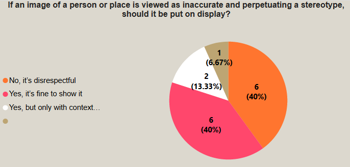
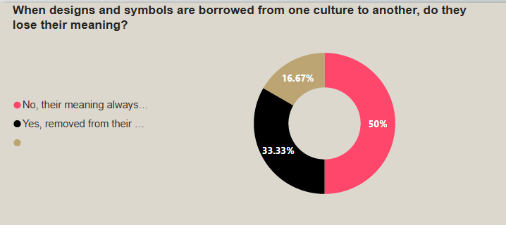
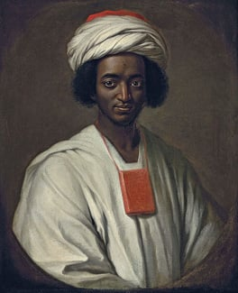

## See how your results compare to others:

[Click here to see the report](https://app.powerbi.com/reportEmbed?reportId=a90c0ad8-6d4c-4655-99bd-1f1a8c11bb01&autoAuth=true&ctid=5564f8ab-c589-4a4d-8c9e-1354800afc71)

## Lusail Museum painting displayed at the National Portrait Gallery!

Ayuba Suleiman Diallo, called Job ben Solomon
by William Hoare of Bath, 1733
Oil on canvas
L245
Property of Qatar Museums Authority

## A sneak peak to Lusail Museum


