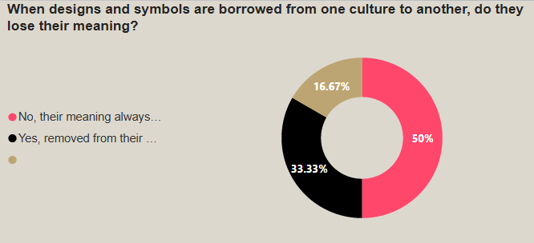

## See how your results compare to others:

[Click here to see the report](https://app.powerbi.com/reportEmbed?reportId=a90c0ad8-6d4c-4655-99bd-1f1a8c11bb01&autoAuth=true&ctid=5564f8ab-c589-4a4d-8c9e-1354800afc71)

## Lusail Museum painting displayed at the National Portrait Gallery!

The exquisite Lusail Museum painting has found its temporary home at the prestigious National Portrait Gallery, capturing the attention and admiration of art enthusiasts from around the world. This remarkable piece, meticulously crafted by a renowned artist, embodies the cultural richness and heritage of Lusail, a city that stands as a testament to Qatar's commitment to art and innovation.

The Chairperson of Qatar Museums, Her Excellency Sheikha Al Mayassa bint Hamad Bin Khalifa Al-Thani in an instagram post:

> "I was thrilled to visit the @NationalPortraitGallery after its reopening and explore the collection of portraits that tell stories of remarkable individuals who have shaped history. It was a pleasure to see the Ayuba Suleiman Diallo painting from Lusail Museum collection, proudly displayed at the NPG, bringing delight to London visitors and fostering international artistic exchange."

*Ayuba Suleiman Diallo, called Job ben Solomon by William Hoare of Bath, 1733 Oil on canvas L245 (Property of Qatar Museums Authority)*

## A sneak peak to Lusail Museum


